# QuickChat

QuickChat is a full-stack application that allows users to communicate with each other in real-time.

## Features

- Real-time chat functionality using Socket io
- Online user status
- Supports 32 different themes
- User authentication with JWT
- Secure password hashing with Bcrypt
- User profile management
- Responsive design with Tailwind CSS and DaisyUI
- Cloud image uploads with Cloudinary
- Global state management with Zustand

## Technologies Used

### Frontend:

- **React** - For building user interfaces.
- **Tailwind CSS** - For styling and responsive design.
- **DaisyUI** - For UI components.
- **Zustand** - For global state management.
- **react-hot-toast** - For showing toast notifications in the app.
- **lucide-react** - For providing icons in the app.

### Backend:

- **Express** - Web framework for handling HTTP requests and routing.
- **Socket io** - Real-time messaging with Socket io

### Data Fetching:

- **Axios** - For making HTTP requests to the backend

### Database:

- **MongoDB** - For storing user data.
- **Mongoose** - For interacting with MongoDB.

### File Storage:

- **Cloudinary** - For storing and serving images and media files.

### Security:

- **JWT** - For authentication and authorization.
- **Bcrypt** - For password hashing.

### Deployment:

- **Frontend**: Deployed on Render.
- **Backend**: Deployed on Render.

## Visual Overview

### User Signup Interface
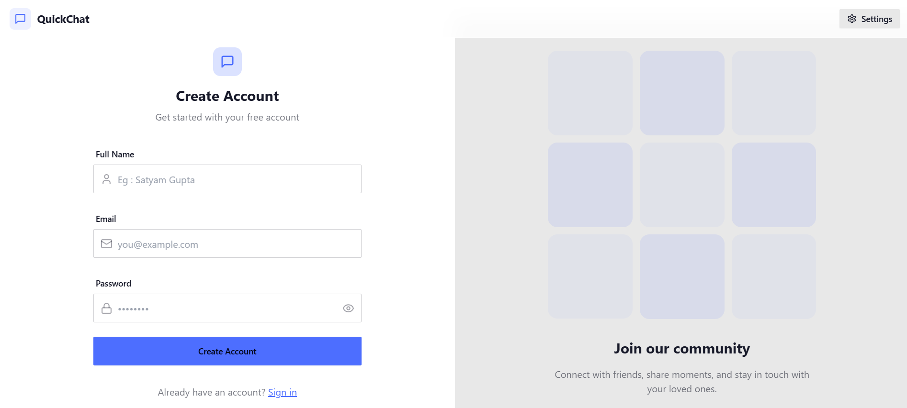

### User Login Interface
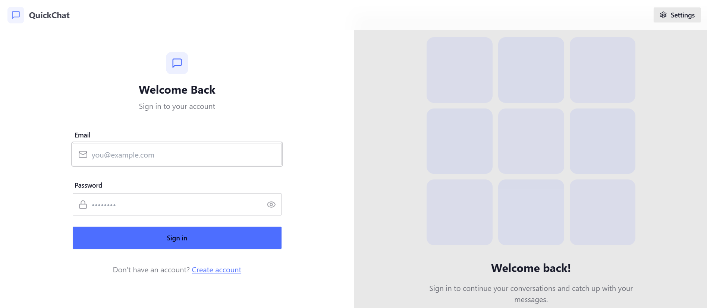

### User Dashboard Interface
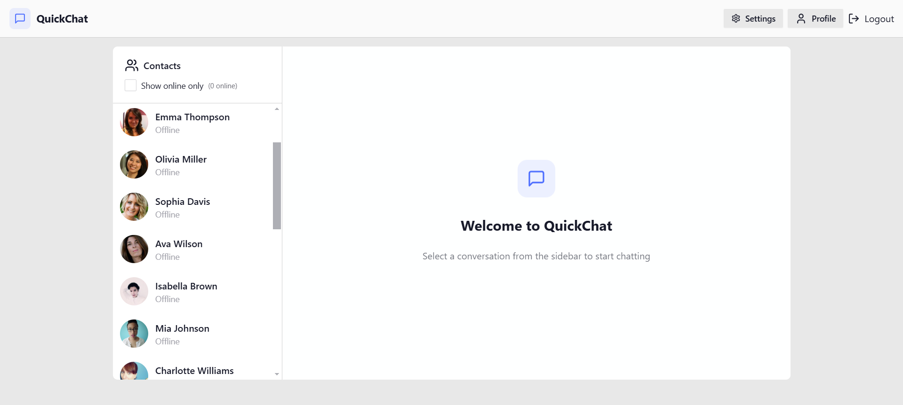

### User Chat Interface
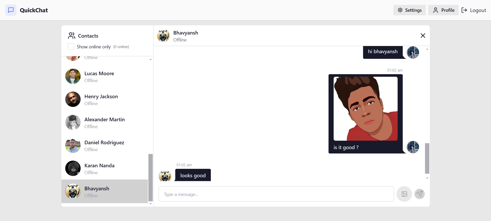

### User Settings Page
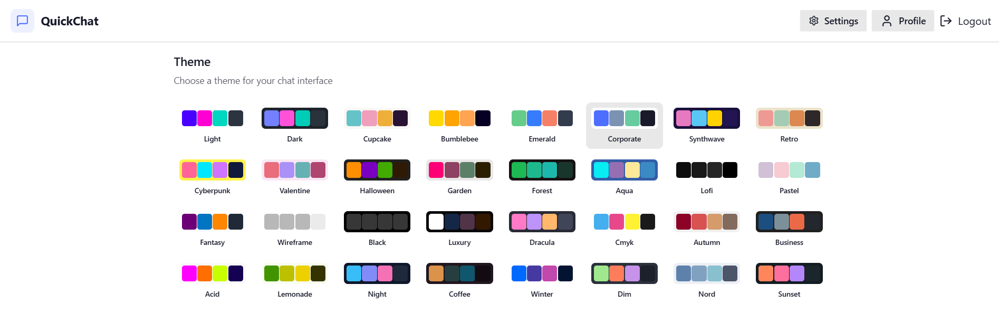
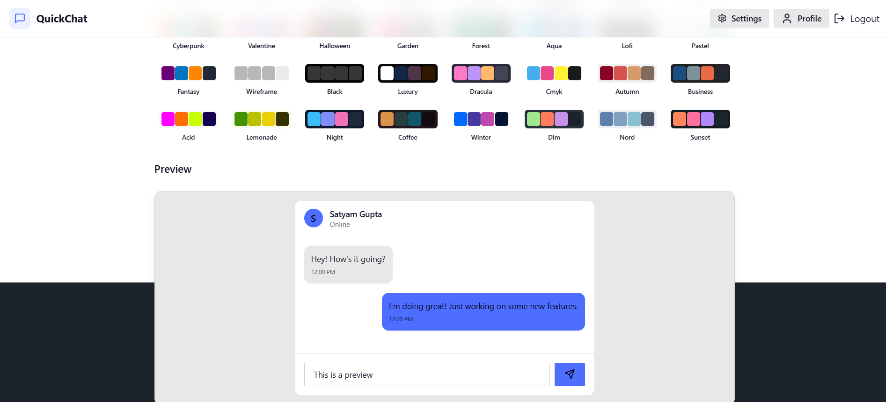

### User Profile Page
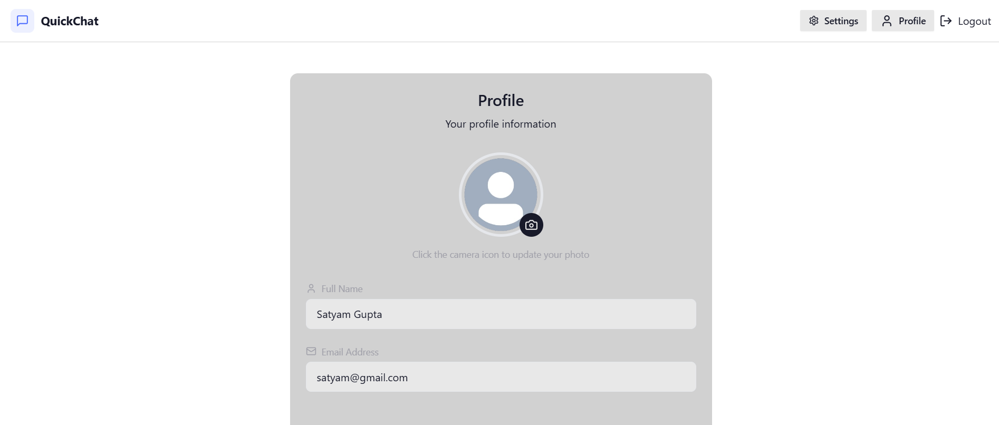
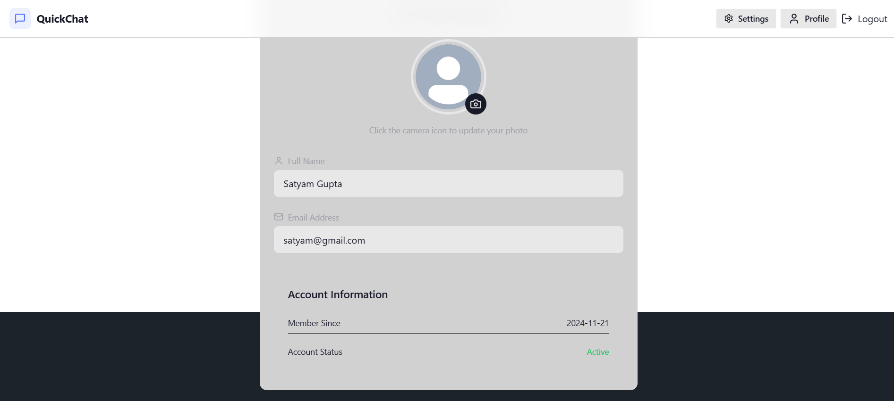

### Total 32 Different Themes
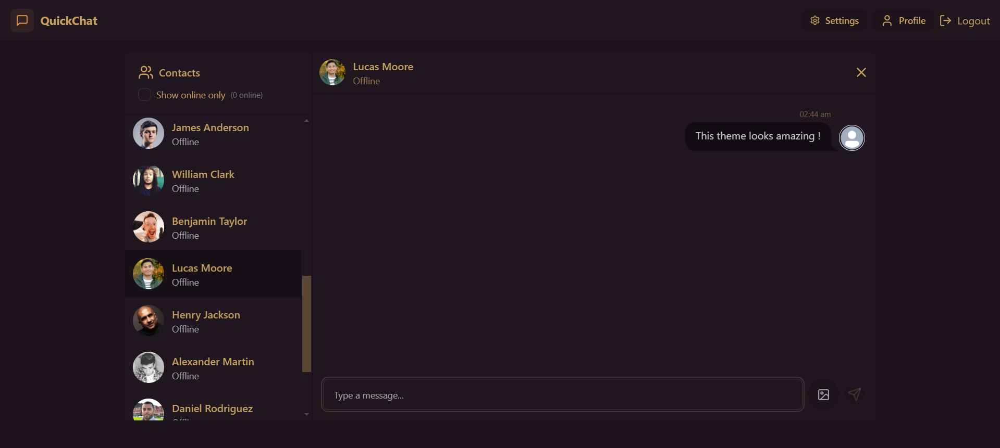
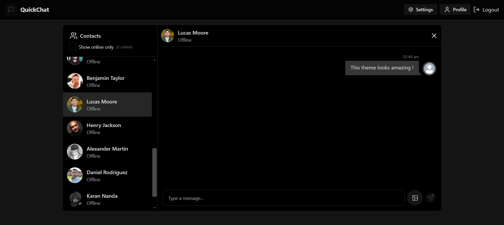
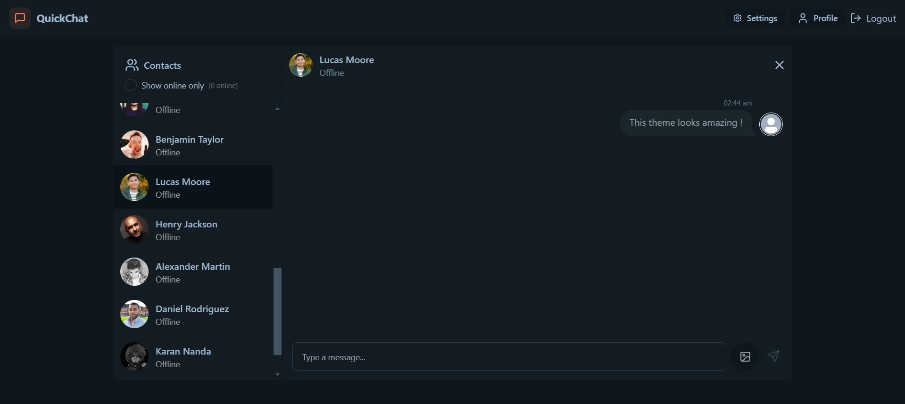
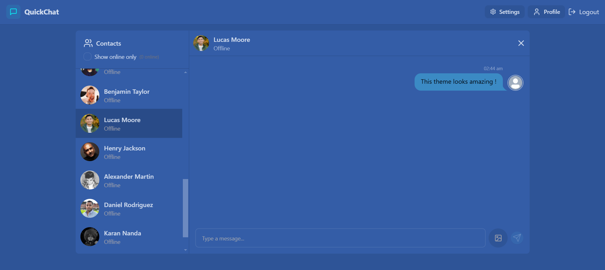
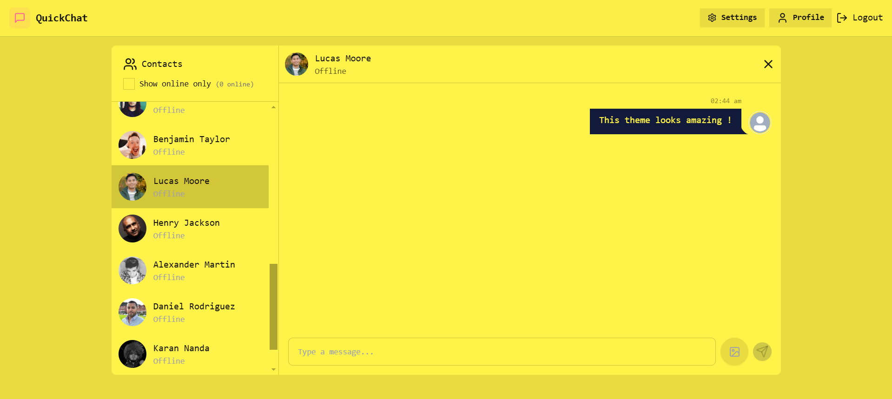